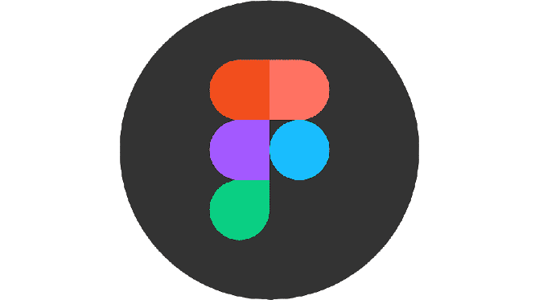

Olá, meu nome é Laís!👋
=============================

- 🔭 Atualmente trabalhando com desenvolvimento fullstack 
- 🌱 Sempre buscando desenvolver através do meu trabalho habilidades em: HTML, CSS, JavaScript, e alguns frameworks, como Laravel e Vue.js 

 ____________________________________________

| |  | | |  |  | | 

_______________________________________

# GitHub Analytics

  
